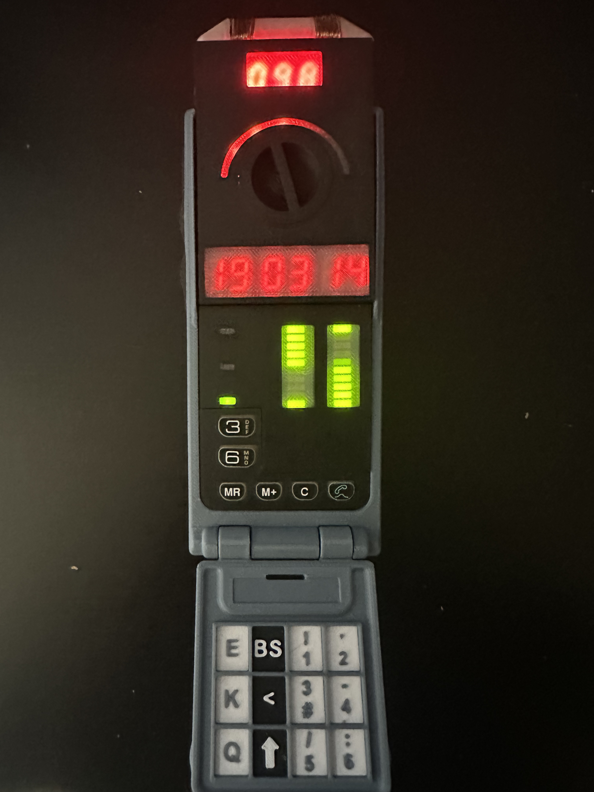

## Sliders Timer Replica — Guide en français

Bienvenue dans le projet de réplique du Timer de la série TV Sliders. Ce dépôt contient:

- Code source Arduino (firmware) pour piloter l’afficheur, les LEDs et le son
- Fichiers STL pour imprimer le boîtier en 3D
- Schéma électronique et Gerbers pour fabriquer le PCB
- Photos et documents explicatifs (EN/FR)

### Contenu du dépôt

- `CODE/` : Sketch Arduino principal, bibliothèques et sons
- `STL/` : Pièces du boîtier à imprimer en 3D
- `PCB/` : Schéma et fichiers de fabrication (Gerbers)
- `PARTS/` : Liste des composants (BOM)
- `DOCS/` : Documentation PDF en français et en anglais
- `PICTURES/` : Photos de la réplique et du PCB

### Fonctionnalités

- Réplique visuelle et fonctionnelle inspirée du Timer de Sliders
- Afficheur 7‑segments sur pilote MAX7219 (2 matrices) + barre de LEDs NeoPixel
- Effets sonores via module DFPlayer Mini
- Boutons de contrôle, modes spéciaux (vortex), compte à rebours

### Matériel requis (résumé)

- Carte Arduino Nano (ATmega328P — A6/A7 requis)
- 2 x matrices MAX7219 pour 7‑segments (câblées en chaîne)
- Bandeau NeoPixel (7 LEDs) sur D4
- Module DFPlayer Mini + carte microSD (sons `0001.mp3`, `0002.mp3`)
- Boutons poussoirs (Start, Up, Down, Vortex)
- Potentiomètre (A6) et mesure batterie (A7)
- Haut‑parleur/sonnette sur D5

Pour le détail du câblage, des librairies et du flash, consultez `CODE/README.md`.

### Démarrage rapide

1) Imprimez les pièces 3D depuis `STL/`
2) Faites fabriquer le PCB avec les Gerbers dans `PCB/`
3) Soudez les composants selon le schéma `PCB/Schematic_*.pdf`
4) Copiez les sons de `CODE/SOUNDS/` sur une microSD (noms 0001.mp3, 0002.mp3)
5) Installez les bibliothèques Arduino puis téléversez `CODE/sliders_timer_main/sliders_timer_main.ino`

### Documentation détaillée

- Guide firmware: `CODE/README.md`
- PCB et fabrication: `PCB/README.md`
- Impression 3D: `STL/README.md`
- Index des documents: `DOCS/README.md`

### Contribuer

Toute contribution est la bienvenue: corrections, améliorations du code, de la doc, ou du design mécanique.

### Licence

Sliders Timer Replica © 2021 by Kenny Caldieraro — CC BY‑NC‑SA 4.0. Voir `LICENSE`.

