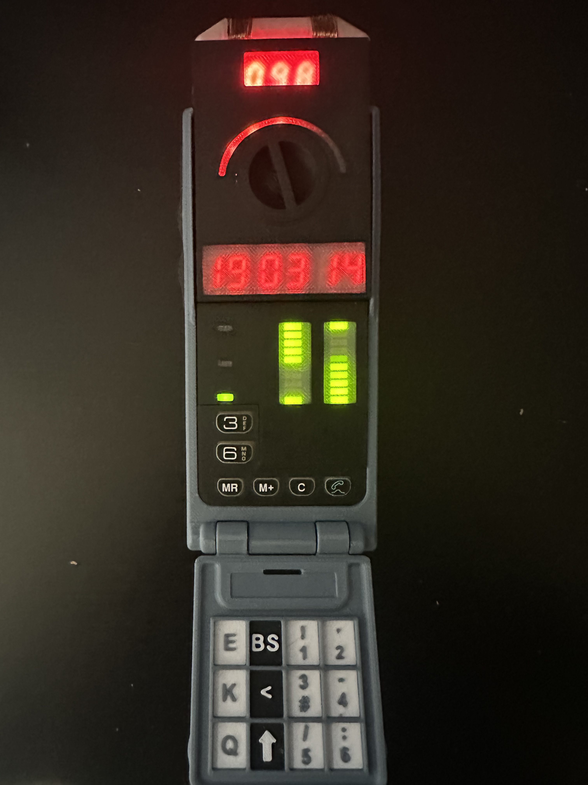

# Sliders Timer Replica

Welcome to the **Sliders Timer Replica** project! This project faithfully recreates the iconic "Timer" from the TV show _Sliders_, a device used for traveling between parallel universes. This replica is based on an Arduino microcontroller and includes electronic components, 3D design files, and the necessary schematics to build the casing and PCB.



## Project Content

- **Source Code**: Arduino sketch to control the Timer.
- **STL Files**: 3D models for printing the Timer casing.
- **Electronic Schematic**: Complete circuit diagrams for assembling the components.
- **Gerber Files**: Files for fabricating the PCB.
- **Photos**: Images of the completed Timer and various construction stages.

## Features

- **Visual and Functional Replica**: Design inspired by the _Sliders_ Timer, featuring an LED display to simulate the countdown.
- **Arduino Timer**: The Timer uses an Arduino microcontroller to handle the countdown and display functions.
- **3D Printable Casing**: All the necessary files to 3D print the casing are included in STL format.
- **DIY PCB**: The schematic and Gerber files allow you to build your own PCB for the Timer.
- **Easily Modifiable**: The code and schematics are provided for you to modify or improve as needed.

## Required Materials

To build this project, you will need the following:

- **Arduino Microcontroller** (e.g., Arduino Nano or similar)
- **7-segment LED display** or equivalent
- **Push buttons** for controls
- **Resistors, capacitors, etc.** (see the electronic schematic for a full list of components)
- **PCB** (Gerber files included for fabrication)
- **3D printed casing** (STL files provided)

### Component List

You can find the full list of required components in the [component list](./PARTS/ORIGINAL%20TIMERS%20PARTS.pdf) provided in this repository. This includes all resistors, capacitors, connectors, and other electronic parts required for the assembly.

## Installation Instructions

1. **Download the repository**:
   Clone this repository to your local machine:

   ```bash
   git clone https://github.com/kenny-caldieraro/Sliders-timer-replica.git

   ```

2. **3D Printing**:
   Print the casing parts using the provided STL files. Make sure you have a 3D printer and the appropriate filament.

3. **PCB Fabrication**:
   Use the Gerber files to order or fabricate the PCB.

4. **Electronic Assembly**:
   Assemble the electronic components as shown in the provided schematic and solder them onto the PCB.

5. **Upload the Code**:
   Upload the Arduino code to your microcontroller using the Arduino IDE:

   ```bash
   arduino-cli compile --upload
   ```

6. **Final Assembly**:
   Mount everything inside the 3D-printed casing and connect the components according to the diagrams.

## If you like it

[Support me on Buy Me a Coffee](https://buymeacoffee.com/kenny.caldieraro)

## Contributing

Contributions are welcome! If you'd like to improve this project, feel free to fork the repository and submit a pull request. Whether it's adding features, optimizing the code, or improving documentation, all help is appreciated.

## License

Sliders Timer Replica © 2021 by Kenny Caldieraro is licensed under CC BY-NC-SA 4.0 - see the LICENSE file for details.
